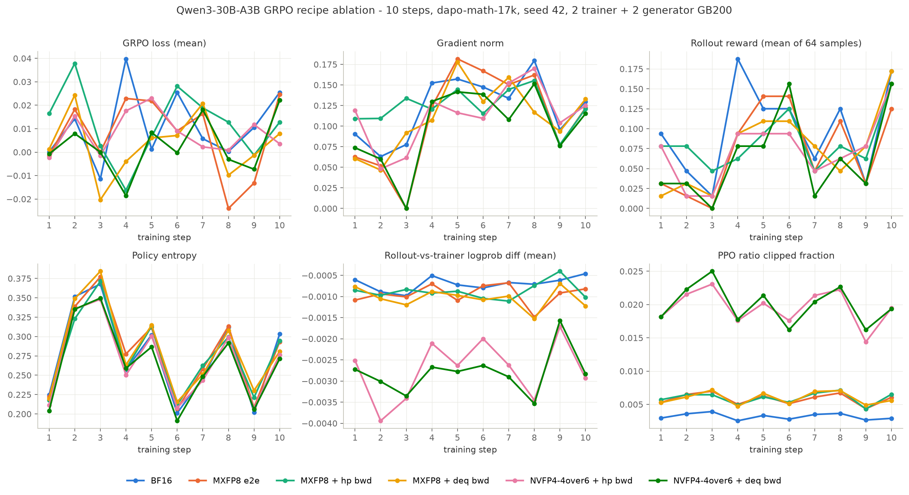

# Qwen3-30B-A3B GRPO recipe ablation — MXFP8 / NVFP4-4over6 experts

Reduced-scale replication of the six-configuration RL quantization ablation
from [lmsys.org/blog/2026-07-29-mxfp8-nvfp4-rl](https://lmsys.org/blog/2026-07-29-mxfp8-nvfp4-rl)
on TitanRL (`torchtitan.experiments.rl`) with the torchao-backed
`MXFP8GroupedExpertsConverter` / `NVFP4FourOverSixGroupedExpertsConverter`
from this branch. Run 2026-08-25/26 on one GB200 node (4 GPUs).

## Contract (identical across all six arms)

- **Model**: Qwen3-30B-A3B (48 layers), HF checkpoint init.
- **Topology**: 1 node x 4 GB200 — trainer TP2/EP2 on GPUs 0-1, one vLLM
  generator TP2/EP2 on GPUs 2-3, synchronous on-policy loop
  (`target_offpolicy_steps=0`), weights refit each step via torchstore
  (BF16 masters; low-precision arms re-quantize dynamically each forward).
- **Workload**: GRPO on dapo-math-17k, 10 training steps x 64 samples
  (8 prompts x 8 samples), max 2048 response tokens / 4096 total
  (blog uses 8192 — scaled down to fit the node window), std-normalized
  advantages, zero-variance reward groups **kept** (advantage 0) so per-step
  sample counts stay fixed across arms.
- **Optimizer**: AdamW lr 1e-6, warmup 2 + linear decay over 10 steps,
  weight decay 0 on quantized expert weights / 0.1 elsewhere
  (BF16 arm: single default group).
- **Quantized scope** (low-precision arms): routed-expert w1/w2/w3 grouped
  GEMMs of layers 0-39 only. Last 8 of 48 layers, attention, router,
  embeddings, lm_head, norms, and the KV cache stay BF16.
- **Validation**: AIME2025, 16 samples, greedy, at step 0 and step 10.
- **Seeds**: trainer and generator seeded 42; each arm starts from the same
  HF checkpoint (the launcher refuses to reuse an existing output folder).

### Arms

| arm | experts forward (train + rollout) | experts backward |
|---|---|---|
| `arm_bf16` | BF16 | BF16 |
| `arm_mxfp8_e2e` | MXFP8 (rceil) | MXFP8 quantized |
| `arm_mxfp8_hp` | MXFP8 (rceil) | `high_precision` (BF16 on original inputs) |
| `arm_mxfp8_deq` | MXFP8 (rceil) | `dequantized` (BF16 on dequantized fprop operands) |
| `arm_nvfp4_hp` | NVFP4 4over6, row-scaled activations (MSE, bound 256, 1x16 weight blocks) | `high_precision` |
| `arm_nvfp4_deq` | same | `dequantized` |

## Results (10 steps each; means over steps 1-10)

| arm | loss mean | grad-norm mean | reward mean | reward @10 | logprob diff mean | clip-frac mean |
|---|---|---|---|---|---|---|
| `arm_bf16` | 0.0111 | 0.123 | 0.098 | 0.172 | -0.00070 | 0.32% |
| `arm_mxfp8_e2e` | 0.0074 | 0.110 | 0.073 | 0.125 | -0.00095 | 0.58% |
| `arm_mxfp8_hp` | 0.0118 | 0.123 | 0.083 | 0.156 | -0.00088 | 0.60% |
| `arm_mxfp8_deq` | 0.0032 | 0.112 | 0.075 | 0.172 | -0.00104 | 0.59% |
| `arm_nvfp4_hp` | 0.0080 | 0.114 | 0.073 | 0.156 | -0.00273 | 1.96% |
| `arm_nvfp4_deq` | 0.0027 | 0.099 | 0.064 | 0.156 | -0.00280 | 1.99% |

(Full per-step data in `training_metrics.csv`, aggregates in `summary.csv`;
regenerate both plus the chart with `make_results.py <outputs_dir> <results_dir>`.)

### Findings

1. **No divergence in any arm.** Loss oscillates within +-0.04 of zero,
   gradient norms stay in 0.046-0.182, entropy curves are superimposable,
   zero NaNs. Ten steps at lr 1e-6 is a short horizon — this is a
   stability/parity smoke, not a convergence claim.
2. **Quantization is visible exactly where the blog says it should be**: in
   the rollout-vs-trainer logprob difference (BF16 floor ~0.0007 nats,
   MXFP8 ~0.0010, NVFP4 ~0.0027) and the PPO ratio clipped fraction
   (~0.3% / ~0.6% / ~2%). Backward mode (`high_precision` vs `dequantized`)
   has no visible effect on either — the mismatch is a forward/rollout
   property. Loss/reward/grad-norm/entropy show no precision ordering.
3. **Step-3 zero-grad no-ops** in `arm_mxfp8_e2e` and `arm_nvfp4_deq`
   (grad norm exactly 0) are all-zero-reward rollout batches: with
   zero-variance groups kept, a batch where no sample earns reward has
   all-zero advantages by construction. Not a numerics fault.
4. **AIME2025 at this scale is noise**: 0 or 1 of 16 problems solved
   pre/post across arms, with the +-1 flips uncorrelated with precision.
   Expected for 10 updates at lr 1e-6.
5. **Wall time** (launch to final save): BF16 ~80 min, MXFP8 ~91 min,
   NVFP4 ~113 min; plus ~25 min closing validation + teardown. The first
   arm on each node pays a ~525 s cold NFS checkpoint load (warm arms
   load in ~10 s) — the BF16 figure includes one. Final model-only fp32 DCP save (115G) ~1060 s to NFS.
   Closing 16-sample greedy validation: BF16 342 s, MXFP8 ~430 s,
   NVFP4 ~525 s.
6. **NVFP4 rollout needs the fused row-scaled forward**
   (`FOUR_OVER_SIX_GROUPED_ROW_SCALED_FUSED_BF16_OUT=1`, set by the
   launcher): the per-group loop path decodes at ~41 tok/s and validates in
   2908 s vs ~525 s fused. Fused == loop + one extra BF16 rounding on the
   GEMM output. With it, NVFP4 rollout decodes at ~250 tok/s at 64
   concurrent requests vs ~400 tok/s BF16 — the fused path closes the gap
   from ~10x to ~1.6x, it does not reach parity. The remaining NVFP4
   rollout tax is per-forward re-quantization of expert weights; a
   quantize-once-per-refit weight cache is the natural (numerics-neutral)
   follow-up.

## Files

- `training_curves.png` — 2x3 small multiples, all six arms.
- `training_metrics.csv` — long-form per-step scalars (arm, metric, step, value).
- `summary.csv` — per-arm aggregates (source of the table above).
- `make_results.py` — regenerates all three from the arms' tfevents.
- `run_ablation_arm.sh` — launches one arm in the vLLM 26.08 container
  (topology, paths, seeds, metrics sinks; CUDA preflight; GPU-mem sampler).
- `run_wave.sh` — runs arms sequentially on a node, one log per arm.
- `../ablation_arms.py` (repo root) — the six arm configs; workload knobs
  live there so every arm shares them, selected via `--module ablation_arms
  --config <arm>`.

The launch scripts are records of the exact runs: paths, container image,
and IMEX device flags are specific to the GB200 cluster they ran on.
Per-arm outputs (tfevents, structured JSONL logs, rollout samples, and the
step-10 fp32 model-only DCP checkpoints, 115G each) live outside the repo
on the cluster scratch volume.
